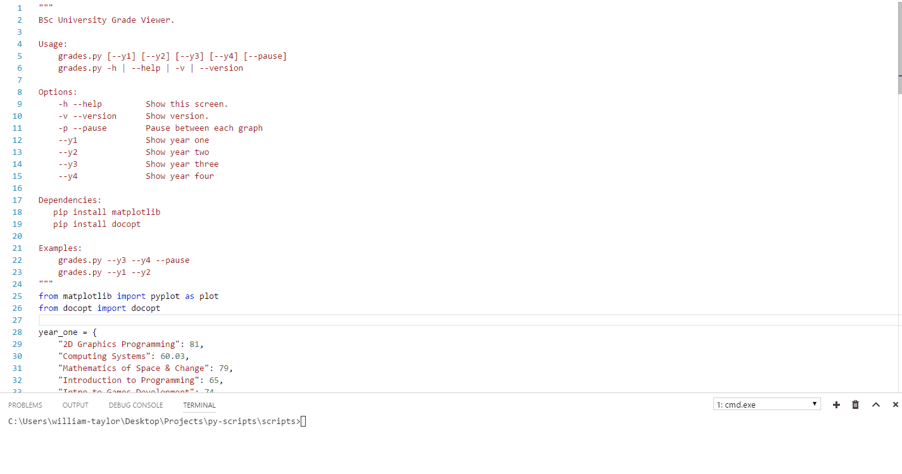

# Python Scripts

This repository just houses a collection of python scripts for testing infrastructure, building projects, generating data and a host of other things as well. Time to time I will also add scripts to generate charts from data and prototype ideas. However as all of these are rather small items I decided to house all scripts in a single repository.

## Overview

At the time of writing this README the repository has the following scripts that were written when learning and playing with the language and it's popular libraries.

**Linkedin.py**: Generates a redirect page so you can choose what image is displayed on your LinkedIn profile when adding an external link. You specifiy the link via a command line argument and it then generates the page from `template.html` found in the data folder.

**Domain.py**: Allows me to test an active domain or a sequence of domains put in a standard text file. The test is configurable through command line arguments which are explained in the documentation.

**Response.py**: Very similar to `domain.py`, however this allows me to test the time required to received a response from a server. Handy little utility to check any Node or Django node server I deploy. How the response time is tested is configurable from the command line

**Hardware.py**: Prints generic hardware info, handy to double check hardware. Hardware to print is specified via command line arguments.

**Grades.py**: Displays a chart for each year at university as to monitor performance. What is viewed and displayed is configured through command line argument.

## Technology

* Python & Pip
* Requests
* Matplotlib
* Colorama
* Docopt

## License

MIT